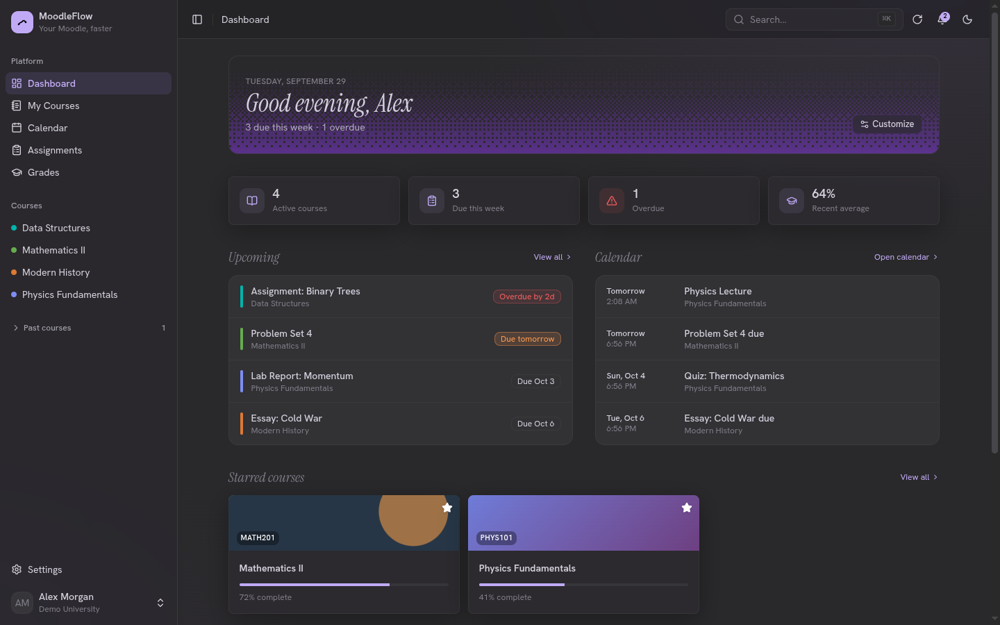
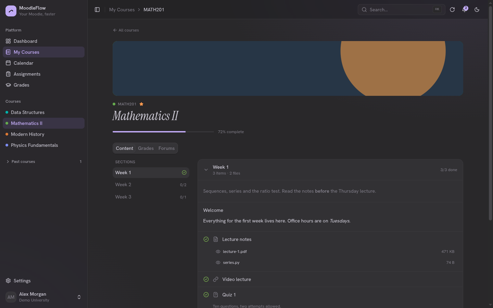
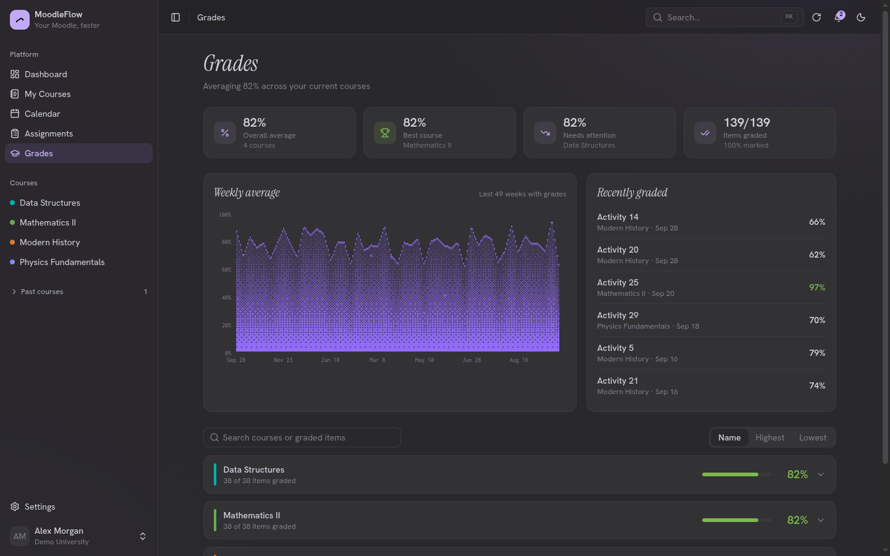
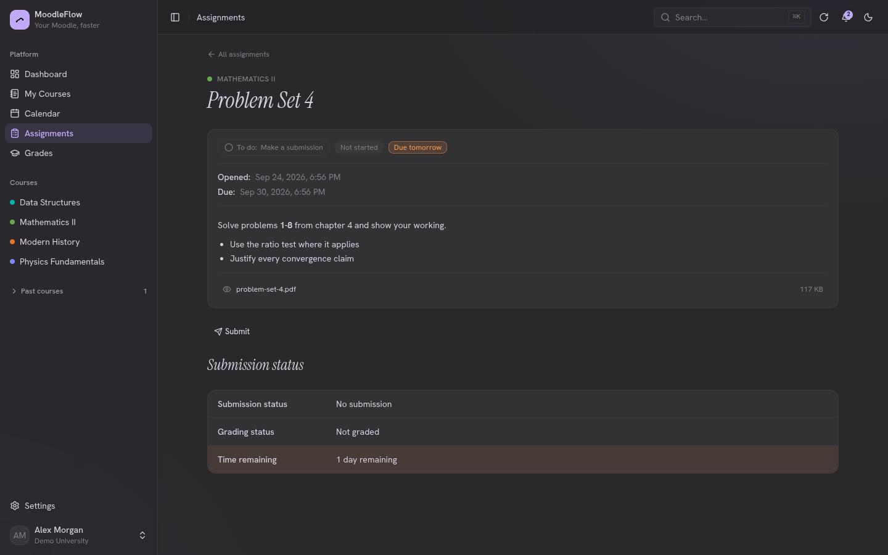
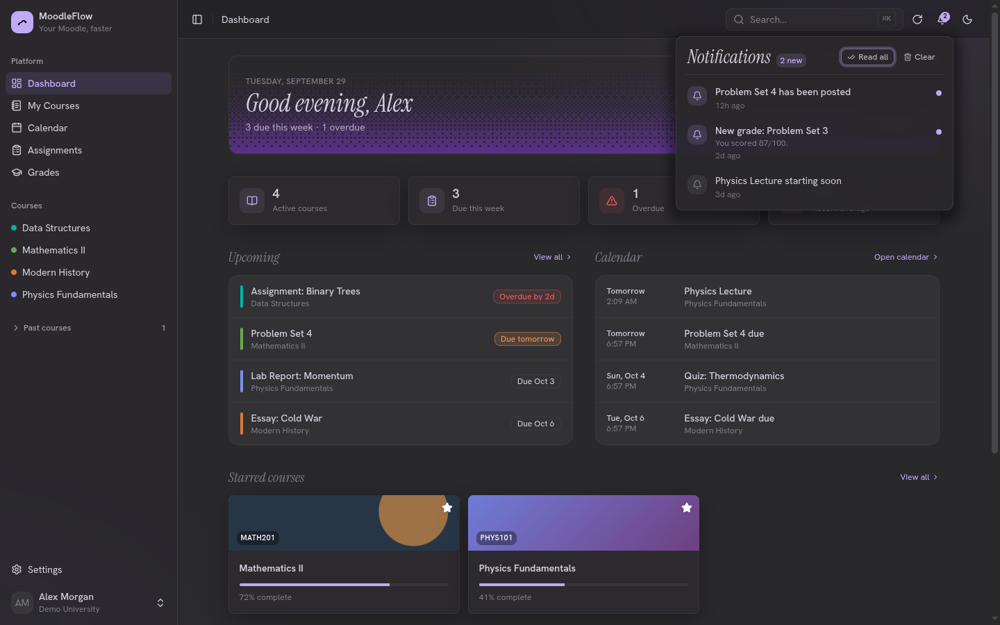
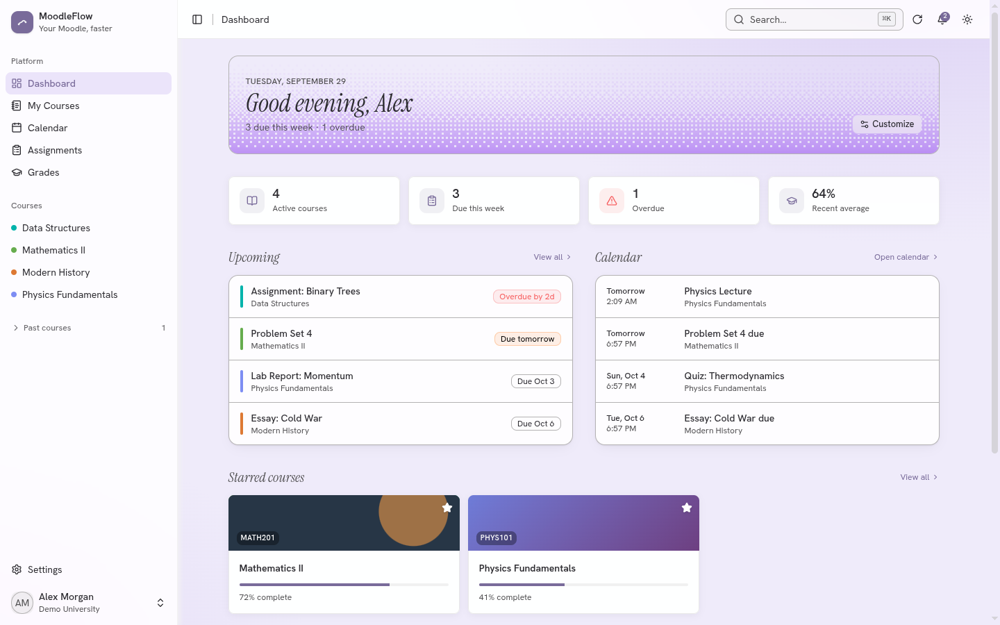
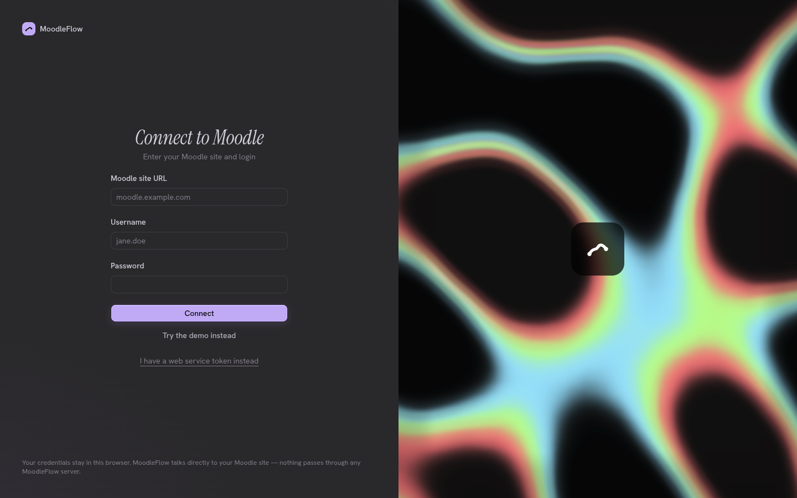
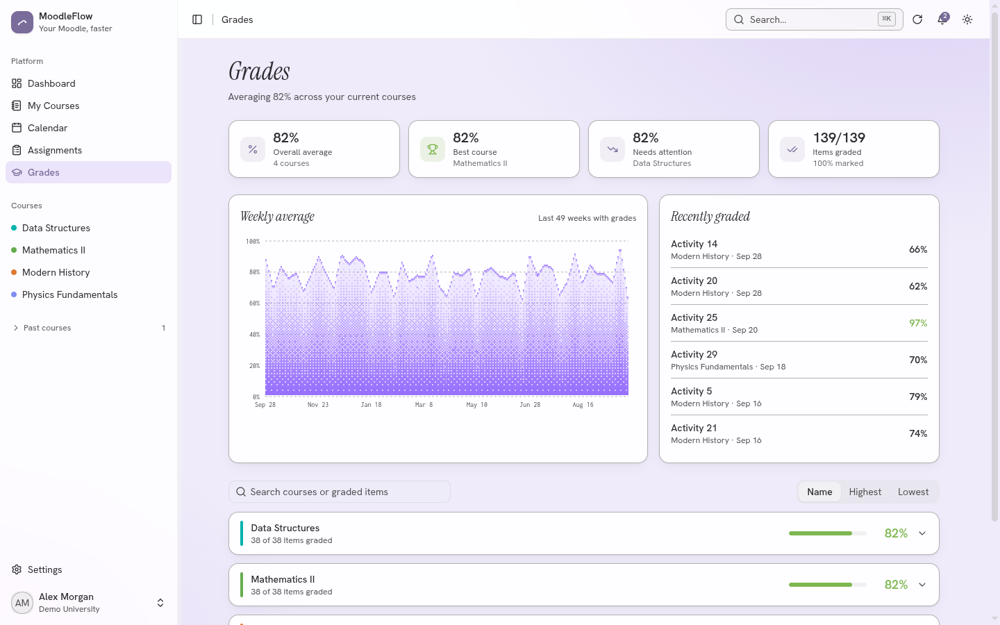

<div align="center">

# MoodleFlow

**A faster, prettier front-end for the Moodle you already use.**

Sign in with your school's Moodle and get a modern dashboard, course pages, grades and assignment submission, with no backend and no account. Your credentials never leave your browser.

[**Live app**](https://moodleflow.tomasps.workers.dev) · [Changelog](CHANGELOG.md) · [Releases](../../releases)



</div>

## Why

Moodle is powerful, but the default interface is slow and dense. MoodleFlow is a client for Moodle's own Web Services API: same data, same permissions, a much nicer way to read and act on it. There is no MoodleFlow server, so nothing to sign up for and nothing that can leak your data.

Not sure it's for you? Press **Try the demo instead** on the connect screen to explore everything with sample data.

## Features

- **Dashboard** with what's due this week, what's overdue, an upcoming list, a calendar preview, starred courses and an activity heatmap. Show or hide any section.
- **Courses** with banner images, and a sticky section sidebar that tracks where you are, shows per-section progress, and surfaces summaries, descriptions, file counts and the next due date. Text-and-media blocks render in full.
- **Assignments** with real submission status, a detail page (opened and due dates, completion, grade, teacher comments), text and file submission, drag-and-drop uploads, and remove or submit-for-grading.
- **Grades** with overall, best and needs-attention stats, a weekly trend chart, a recently-graded list, search, sorting, per-item feedback and dates.
- **Files** opened in the app: PDFs, images and syntax-highlighted code, without leaving the page.
- **Forums, calendar and notifications** including mark-all-read, per-item dismiss, and a `⌘K` command palette to jump anywhere.
- **Themes and personalisation**: dark, darker, OLED, light, ink, Rosé Pine and Kanagawa Dragon, accent colours or a custom hue, glass blur, seasonal tints and falling snow, corner radius, fonts, text size, week start and 12/24h clock. All of it is saved in your browser.
- **Stays signed in** across visits, and prompts you to reload when a new version is deployed.
- **Demo mode** with realistic sample data, no Moodle site required.

## Screenshots

| Course page | Grades |
| --- | --- |
|  |  |

| Assignment | Notifications |
| --- | --- |
|  |  |

| Light mode | Sign in |
| --- | --- |
|  |  |

<details>
<summary>Grades in light mode</summary>



</details>

## Privacy and security

- Your Moodle URL and token are stored only in your browser's `localStorage`. They are never sent to a MoodleFlow server, because there isn't one.
- Every Moodle call is made from your browser, over HTTPS, straight to the site you enter. Usernames and passwords go in a POST body to Moodle's own `login/token.php`, and only the resulting token is kept.
- Teacher-written HTML is sanitised with DOMPurify before it is shown, and inline colours are stripped so text stays readable on any theme.
- UI preferences (not your token) are also backed up in a cookie so they survive cleared site data.
- **Sign out** in Settings removes the stored connection.

## Architecture

```
Browser (Next.js app on Cloudflare Workers)
   │  fetch(), directly from the browser
   ▼
Your Moodle site's REST web service (webservice/rest/server.php)
```

Because the browser talks to Moodle directly, **your Moodle site must allow cross-origin requests from the origin MoodleFlow is served from** (see below). Without that, requests fail with a network error and MoodleFlow shows a "Moodle isn't responding" state.

## Moodle setup

MoodleFlow is a Web Services client. On your Moodle site:

1. **Site administration → Advanced features**: enable *Web services*.
2. **Site administration → Server → Web services → Manage protocols**: enable the *REST protocol*.
3. **Site administration → Server → Web services → External services**: use the built-in "Moodle mobile web service" (it already exposes the functions below), or create a custom service and add the needed functions.
4. **Sign in** with your username and password (MoodleFlow requests a token for you), or create one under **Manage tokens** and paste it in.
5. **Site administration → Server → HTTP → Allowed CORS origins**: add the origin MoodleFlow is served from (e.g. `http://localhost:3000` for development, your production URL for deployment). Available on Moodle 4.3+.

### Web service functions used

| Feature | Functions |
| --- | --- |
| Site info / current user | `core_webservice_get_site_info` |
| Courses, starring | `core_enrol_get_users_courses`, `core_course_set_favourite_courses` |
| Course content, completion | `core_course_get_contents`, `core_completion_get_activities_completion_status` |
| Calendar | `core_calendar_get_calendar_upcoming_view` |
| Assignments | `mod_assign_get_assignments`, `mod_assign_get_submission_status`, `mod_assign_save_submission`, `mod_assign_submit_for_grading`, `mod_assign_remove_submission` |
| Comments | `core_comment_get_comments`, `core_comment_add_comments` |
| Grades | `gradereport_user_get_grade_items` |
| Forums | `mod_forum_get_forum_discussions` |
| Notifications | `message_popup_get_popup_notifications`, `core_message_mark_notification_read`, `core_message_mark_all_notifications_as_read` |
| File uploads | `webservice/upload.php` |

Moodle installations vary by version and plugins. If a function isn't available, the affected page shows an empty or error state instead of crashing.

## Getting started

Requirements: [Bun](https://bun.sh/) 1.x. A Moodle site is optional, since demo mode works without one.

```bash
bun install
bun run dev
```

Open [http://localhost:3000](http://localhost:3000). On the connect screen either sign in to your Moodle or click **Try the demo instead**.

```bash
bun run test      # unit tests (vitest)
bun run build     # OpenNext production build for Cloudflare
bun run check     # build + TypeScript check
bun run preview   # build and preview against the Workers runtime
```

### Deployment

MoodleFlow deploys to [Cloudflare Workers](https://developers.cloudflare.com/workers/) through [OpenNext](https://opennext.js.org/cloudflare). With Workers Builds connected to this repository:

- **Build command:** `bun run build`
- **Deploy command:** `npx wrangler deploy`

Publishing a GitHub release triggers a build and deploy. Configuration lives in `wrangler.jsonc` and `open-next.config.ts`. No bindings (KV, D1, R2) are used because all state lives in the browser, and no environment variables are required.

## Releasing

Versions follow [SemVer](https://semver.org/) and live in `package.json`, with human-written notes in [`CHANGELOG.md`](CHANGELOG.md) (also shown in the app at `/changelog`). To release:

1. Add entries under `Unreleased`, then rename it to the new version and date.
2. Bump `version` in `package.json` (a test fails if it and the newest changelog entry disagree).
3. Commit, tag `vX.Y.Z`, push, and create a GitHub release with that changelog section.

Open tabs check `/api/version` and prompt users to reload when a new build is live.

## Tech stack

- [Next.js](https://nextjs.org/) (App Router), React 19 and TypeScript
- [Cloudflare Workers](https://developers.cloudflare.com/workers/) via OpenNext and Wrangler
- Tailwind CSS v4, [Base UI](https://base-ui.com/) and shadcn/ui components, [Lucide](https://lucide.dev/) icons
- [Motion](https://motion.dev/), [cmdk](https://cmdk.paco.me/), [Shiki](https://shiki.style/), [DOMPurify](https://github.com/cure53/DOMPurify), [canvas-confetti](https://github.com/catdad/canvas-confetti)
- [Vitest](https://vitest.dev/) for tests and [Bun](https://bun.sh/) as package manager

## Project structure

```text
src/
  app/
    (auth)/connect/       Sign-in screen
    (app)/                App shell: dashboard, courses, calendar, assignments,
                          grades, notifications, settings, profile, changelog
    api/version/          Build id, read by the update prompt
  components/
    ui/                   shadcn/ui primitives
    layout/ navigation/   Sidebar, top bar, command palette
    courses/ assignments/ grades/ files/ dashboard/   Domain components
    providers/            Theme, preferences and Moodle connection context
  lib/
    moodle/
      client.ts           Moodle REST client (browser fetch)
      mock.ts             Demo-mode client with sample data
      normalize.ts        Raw Moodle payloads to domain types
    preferences.ts        UI preferences and appearance engine
  styles/bleh/            Theme engine, keyframes and component styles
  types/moodle.ts         Domain models
docs/screenshots/         Images used in this README
```

## Credits

The theme engine, colour system and much of the motion come from bleh, whose styles are GPL-3.0 licensed. Charts use a dithered chart kit adapted for this project.

## License

No license has been chosen yet. Because parts of the styling derive from GPL-3.0 code, choose a compatible license before accepting outside contributions.
